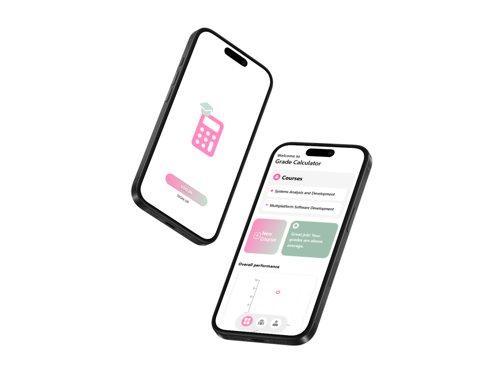

# 📊 GRADE CALCULATOR

  

A simple and intuitive **grade calculator** that helps students **monitor their academic performance** independently.  
With Grade Calculator, you don’t have to wait for your teacher to release your grades — you can **simulate future scores** and find out **how much you need** to pass in each subject or assignment.

---

## ✨ Features

- ✅ Track grades for multiple subjects
- 🧠 Simulate future grades and remaining assignments
- 📈 Instantly see your current average and how much is missing
- 📱 Responsive design (works on mobile and desktop)

---

## 🎯 Why use this?

Because waiting for teachers to upload grades is frustrating.  
With this app, you take control and:

- Know exactly **how much you need to score** in upcoming assignments or tests
- Manage your semester smarter and stress less
- Plan your effort based on real calculations

---

## 🖼️ Preview

 <!-- ou link do Vercel se quiser -->

---

## 🚀 Getting Started

Clone the project and run it locally:

bash
git clone https://github.com/seu-usuario/grade-tracker.git
cd grade-tracker
npm install
npm start
